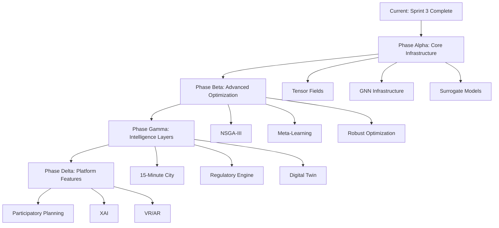

# PlanifyAI Research Integration Roadmap
> **Master Plan for Integrating 62 Research Documents into Production**
>
> **Status:** Active Planning
> **Last Updated:** 2025-12-31
> **Base Version:** v10.2.2
> **Research Base:** 62 documents, 775+ pages extracted to Knowledge Base

---

## Executive Summary

### Current State Analysis
- **Production Features:** Gateway-aware optimization (Sprint 3 ✅), H-SAGA engine, Physics objectives (wind/solar)
- **Research Coverage:** 62 documents covering 23 intelligence pillars
- **Implementation Gap:** ~85% of research insights not yet integrated
- **Technical Debt:** Medium (mostly modular architecture, good test coverage)

### Strategic Vision
Transform PlanifyAI from a "campus optimizer" into a **comprehensive spatial intelligence platform** by systematically integrating research across:
1. **Urban Intelligence:** 15-minute city, accessibility metrics, equity optimization
2. **Generative Design:** Tensor fields, road networks, 3D urbanism
3. **Adaptive Learning:** RL, meta-learning, POE feedback loops
4. **Regulatory Engine:** Turkish building codes, automated compliance
5. **Digital Twin:** BIM, energy modeling, traffic simulation
6. **Advanced Optimization:** GNNs, SAEA, robust optimization

---

## 🎯 Integration Priorities & Dependencies

### Critical Path Analysis



### Impact vs Effort Matrix

| Research Area | Business Impact | Technical Effort | Priority | Timeline |
|--------------|----------------|------------------|----------|----------|
| **Turkish Building Codes** | 🔥 Critical | Medium | P0 | Q1 2026 |
| **15-Minute City Metrics** | High | Low | P0 | Q1 2026 |
| **Tensor Field Roads** | High | High | P1 | Q2 2026 |
| **GNN Surrogates** | Very High | Very High | P1 | Q2-Q3 2026 |
| **NSGA-III Migration** | High | Medium | P1 | Q2 2026 |
| **Energy Modeling (BEM)** | Medium | Very High | P2 | Q3 2026 |
| **Traffic Simulation** | Medium | High | P2 | Q3 2026 |
| **Meta-Learning** | Low | Very High | P3 | Q4 2026 |
| **Quantum Optimization** | Low | Very High | P4 | 2027+ |

---

## 📋 Phase Alpha: Core Infrastructure (Q1 2026)

### Sprint A1: Turkish Regulatory Engine (4 weeks)
**Goal:** Automated building code compliance checking

**Research Sources:**
- `Automated Building Code Compliance Analysis.docx` (Pillar 4.1)
- `Turkish Urban Planning Standards Research.docx` (Section 20)

**Deliverables:**
1. **Dynamic Setback Calculator**
   - Formula: `Setback = Base + (Floors - 4) * 0.5m`
   - High-rise cliff handling (>60.5m → 15m base)
   - Edge cases: Corner lots, irregular parcels

2. **FAR Validator**
   - Emsal (FAR) calculation with 30% exclusions
   - Parking, cores, shelters exemption logic
   - KAKS/TAKS compliance checking

3. **Fire Access Checker**
   - 45m horizontal distance constraint
   - Network graph validation using existing roads
   - Automatic road width validation (6-20m hierarchy)

4. **RASE Rule Engine**
   - JSON rule parser for Turkish building codes
   - PAİY (National General) + TBDY 2018 (Seismic) integration
   - TSE standards (TS 9111, TS 12576) for accessibility

**Implementation:**
```python
# backend/core/regulatory/turkish_codes.py

from dataclasses import dataclass
from typing import List, Dict, Optional
from shapely.geometry import Polygon, Point
import networkx as nx

@dataclass
class TurkishBuildingCode:
    """Turkish building code compliance checker."""

    def calculate_setback(self, floors: int, height: float) -> float:
        """
        Calculate required setback based on Turkish standards.

        Args:
            floors: Number of floors
            height: Building height in meters

        Returns:
            Required setback in meters
        """
        base_setback = 5.0  # Default 5m

        # High-rise cliff
        if height > 60.5:
            return 15.0

        # Progressive setback for taller buildings
        if floors > 4:
            return base_setback + (floors - 4) * 0.5

        return base_setback

    def validate_far(
        self,
        buildings: List[Polygon],
        parcel: Polygon,
        allowed_far: float
    ) -> Dict:
        """
        Validate Floor Area Ratio (Emsal) compliance.

        Turkish rule: 30% of FAR can be parking/cores/shelters
        """
        total_area = sum(b.area for b in buildings)
        parcel_area = parcel.area

        # 30% exemption for utilities
        exemption_area = total_area * 0.30
        taxable_area = total_area - exemption_area

        actual_far = taxable_area / parcel_area

        return {
            'compliant': actual_far <= allowed_far,
            'actual_far': actual_far,
            'allowed_far': allowed_far,
            'margin': allowed_far - actual_far,
            'exemption_area': exemption_area
        }

    def check_fire_access(
        self,
        buildings: List[Polygon],
        road_network: nx.Graph,
        max_distance: float = 45.0
    ) -> List[str]:
        """
        Turkish fire code: 45m max horizontal distance to fire truck access.

        Returns:
            List of building IDs violating fire access
        """
        violations = []

        for i, building in enumerate(buildings):
            centroid = building.centroid

            # Find shortest path to any road node
            min_distance = float('inf')
            for road_node in road_network.nodes():
                dist = centroid.distance(Point(road_node))
                min_distance = min(min_distance, dist)

            if min_distance > max_distance:
                violations.append(f'building_{i}')

        return violations
```

**Testing:**
```python
# tests/test_turkish_codes.py

def test_setback_progressive():
    """Test progressive setback for taller buildings."""
    code = TurkishBuildingCode()

    # 4 floors or less: 5m
    assert code.calculate_setback(4, 12.0) == 5.0

    # 6 floors: 5 + (6-4)*0.5 = 6m
    assert code.calculate_setback(6, 18.0) == 6.0

    # High-rise: 15m
    assert code.calculate_setback(20, 62.0) == 15.0

def test_far_with_exemptions():
    """Test FAR calculation with Turkish 30% exemptions."""
    code = TurkishBuildingCode()

    parcel = Polygon([(0,0), (100,0), (100,100), (0,100)])
    buildings = [
        Polygon([(10,10), (40,10), (40,40), (10,40)]),  # 900 m²
        Polygon([(60,60), (90,60), (90,90), (60,90)])   # 900 m²
    ]

    result = code.validate_far(buildings, parcel, allowed_far=2.0)

    # Total: 1800 m²
    # Exemption: 540 m²
    # Taxable: 1260 m²
    # FAR: 1260 / 10000 = 0.126
    assert result['compliant'] == True
    assert result['actual_far'] < 2.0
```

**Integration Points:**
- Add to `SpatialOptimizationProblem` as constraint layer
- Integrate with `ConstraintCalculator` in spatial_problem.py
- Export compliance report to GeoJSON properties

---

### Sprint A2: 15-Minute City Metrics (3 weeks)
**Goal:** Accessibility-based optimization for Turkish urban context

**Research Sources:**
- `15-Minute City Optimization Analysis.docx` (Pillar 1)
- `Spatial Influence Decay Functions Analysis.docx` (Section 4)

**Deliverables:**
1. **Network Distance Calculator**
   - Replace Euclidean with network-based (Pandana integration)
   - Slope penalty using Tobler's Hiking Function: $v_{adj} = v_{flat} \cdot e^{-k \cdot |s|}$

2. **2SFCA (Two-Step Floating Catchment Area)**
   - Healthcare/education capacity optimization
   - Prevents overcrowding in critical facilities

3. **Turkish Cultural Anchor Points**
   - Mosque (Camii) proximity weight
   - Semt Pazar (weekly market) temporal planning
   - Tea Garden (Çay Bahçesi) accessibility

4. **Gravity Model Accessibility**
   - Formula: $A_i = \sum_{j} O_j \cdot e^{-\beta \cdot d_{ij}}$
   - Customizable decay functions (Gaussian, Power-law, Exponential)

**Implementation:**
```python
# backend/core/metrics/accessibility.py

import pandana as pdna
import numpy as np
from typing import Dict, List, Tuple
from shapely.geometry import Point

class AccessibilityCalculator:
    """15-minute city accessibility metrics for Turkish context."""

    def __init__(self, road_network: pdna.Network):
        self.network = road_network

        # Turkish-specific amenity weights
        self.amenity_weights = {
            'mosque': 0.25,  # High importance for daily prayer
            'market': 0.20,  # Semt pazar accessibility
            'tea_garden': 0.15,  # Social gathering
            'healthcare': 0.15,
            'education': 0.15,
            'transit': 0.10
        }

    def calculate_gravity_accessibility(
        self,
        origins: List[Point],
        destinations: Dict[str, List[Point]],
        decay_function: str = 'exponential',
        beta: float = 0.002
    ) -> np.ndarray:
        """
        Calculate gravity model accessibility.

        Args:
            origins: Building locations
            destinations: Dict of {amenity_type: [locations]}
            decay_function: 'exponential', 'power', 'gaussian'
            beta: Decay parameter

        Returns:
            Accessibility scores for each origin
        """
        scores = np.zeros(len(origins))

        for amenity_type, locations in destinations.items():
            weight = self.amenity_weights.get(amenity_type, 0.1)

            for i, origin in enumerate(origins):
                for dest in locations:
                    # Network distance (not Euclidean)
                    dist = self.network.shortest_path_length(
                        origin.x, origin.y,
                        dest.x, dest.y
                    )

                    # Apply decay function
                    if decay_function == 'exponential':
                        decay = np.exp(-beta * dist)
                    elif decay_function == 'power':
                        decay = 1.0 / (1.0 + dist**2)
                    elif decay_function == 'gaussian':
                        decay = np.exp(-(dist**2) / (2 * (1/beta)**2))

                    scores[i] += weight * decay

        return scores

    def calculate_2sfca(
        self,
        population_locations: List[Point],
        facility_locations: List[Point],
        facility_capacities: List[int],
        catchment_distance: float = 800.0
    ) -> np.ndarray:
        """
        Two-Step Floating Catchment Area for healthcare/education.

        Step 1: Calculate supply-to-demand ratio for each facility
        Step 2: Sum accessible ratios for each population point
        """
        n_pop = len(population_locations)
        n_fac = len(facility_locations)

        # Step 1: Facility ratios
        facility_ratios = np.zeros(n_fac)

        for j, fac in enumerate(facility_locations):
            demand = 0
            for pop in population_locations:
                dist = self.network.shortest_path_length(
                    pop.x, pop.y, fac.x, fac.y
                )
                if dist <= catchment_distance:
                    demand += 1

            if demand > 0:
                facility_ratios[j] = facility_capacities[j] / demand

        # Step 2: Population accessibility
        accessibility = np.zeros(n_pop)

        for i, pop in enumerate(population_locations):
            for j, fac in enumerate(facility_locations):
                dist = self.network.shortest_path_length(
                    pop.x, pop.y, fac.x, fac.y
                )
                if dist <= catchment_distance:
                    accessibility[i] += facility_ratios[j]

        return accessibility
```

**Testing:**
```python
def test_gravity_accessibility():
    """Test gravity model with exponential decay."""
    # Mock road network
    network = create_test_network()

    calc = AccessibilityCalculator(network)

    origins = [Point(0, 0), Point(100, 100)]
    destinations = {
        'mosque': [Point(50, 50)],
        'market': [Point(150, 150)]
    }

    scores = calc.calculate_gravity_accessibility(
        origins, destinations, decay_function='exponential'
    )

    # Origin closer to mosque should score higher
    assert scores[0] > scores[1]
```

**Integration:**
- Add as new objective to `ObjectiveCalculator`
- Create `AccessibilityObjective` class
- Update optimization goals in `OptimizationRequest` schema

---

### Sprint A3: Surrogate Model Infrastructure (4 weeks)
**Goal:** 10x-50x speedup using ML approximation for expensive simulations

**Research Sources:**
- `Surrogate-Assisted Evolutionary Algorithms.docx` (Section 7.6)
- `GNNs for Spatial Planning Analysis.docx` (Section 7.2)

**Deliverables:**
1. **Base Surrogate Framework**
   ```python
   # backend/core/surrogates/base.py

   from abc import ABC, abstractmethod
   import numpy as np

   class SurrogateModel(ABC):
       """Base class for all surrogate models."""

       @abstractmethod
       def train(self, X: np.ndarray, y: np.ndarray):
           """Train on high-fidelity simulation data."""
           pass

       @abstractmethod
       def predict(self, X: np.ndarray) -> np.ndarray:
           """Fast prediction for optimization."""
           pass

       @abstractmethod
       def get_uncertainty(self, X: np.ndarray) -> np.ndarray:
           """Uncertainty estimates for infill criteria."""
           pass
   ```

2. **Gaussian Process (Kriging)**
   - For low-dimensional problems (<20 vars)
   - Provides uncertainty for Expected Improvement (EI) infill

3. **Random Forest**
   - For high-dimensional problems (>50 vars)
   - Robust to noise, fast training

4. **Graph Neural Network (GNN)**
   - For spatial topology (best for campus planning)
   - SE(2)-equivariant for rotation invariance

**Implementation Strategy:**
```python
# backend/core/surrogates/gnn_surrogate.py

import torch
import torch.nn as nn
from torch_geometric.nn import GCNConv, global_mean_pool

class CampusPlanningGNN(nn.Module):
    """
    GNN surrogate for predicting campus layout quality.

    Input: Graph (nodes=buildings, edges=adjacency)
    Output: Fitness scores (compactness, accessibility, etc.)
    """

    def __init__(
        self,
        node_features: int = 10,
        hidden_dim: int = 64,
        num_objectives: int = 4
    ):
        super().__init__()

        self.conv1 = GCNConv(node_features, hidden_dim)
        self.conv2 = GCNConv(hidden_dim, hidden_dim)
        self.conv3 = GCNConv(hidden_dim, hidden_dim)

        self.fc = nn.Linear(hidden_dim, num_objectives)

    def forward(self, x, edge_index, batch):
        """
        Args:
            x: Node features [N, node_features]
            edge_index: Graph connectivity [2, E]
            batch: Batch assignment [N]
        """
        # GCN layers
        x = self.conv1(x, edge_index).relu()
        x = self.conv2(x, edge_index).relu()
        x = self.conv3(x, edge_index).relu()

        # Global pooling
        x = global_mean_pool(x, batch)

        # Prediction
        return self.fc(x)
```

**Training Pipeline:**
```python
# scripts/train_surrogate.py

def train_gnn_surrogate(
    num_samples: int = 1000,
    budget: int = 100_000
):
    """
    Train GNN surrogate on high-fidelity optimization data.

    Strategy:
    1. Run full H-SAGA optimization 1000 times
    2. Collect (layout → fitness) pairs
    3. Convert layouts to graphs
    4. Train GNN to predict fitness from graph
    5. Use GNN for pre-screening in future optimizations
    """
    # Generate training data
    layouts = []
    fitnesses = []

    for i in range(num_samples):
        # Run full optimization
        result = run_hsaga_optimization(budget=budget)

        # Extract all evaluated solutions
        for solution in result.all_solutions:
            graph = solution_to_graph(solution)
            layouts.append(graph)
            fitnesses.append(solution.fitness)

    # Train GNN
    model = CampusPlanningGNN()
    optimizer = torch.optim.Adam(model.parameters(), lr=0.001)

    for epoch in range(100):
        for graph, fitness in zip(layouts, fitnesses):
            pred = model(graph.x, graph.edge_index, graph.batch)
            loss = nn.MSELoss()(pred, fitness)

            optimizer.zero_grad()
            loss.backward()
            optimizer.step()

    return model
```

**Integration:**
- Add `use_surrogate` flag to `HSAGARunnerConfig`
- Pre-screen offspring before expensive evaluation
- Update surrogate periodically with real evaluations

---

## 📋 Phase Beta: Advanced Optimization (Q2 2026)

### Sprint B1: NSGA-III Migration (3 weeks)
**Goal:** Replace current H-SAGA with NSGA-III for many-objective optimization

**Research Sources:**
- `Multi-Objective Evolutionary Algorithms.docx` (Section 7.3)
- `OPTIMIZATION_SUMMARY.md` (Section 1)

**Rationale:**
- Current H-SAGA good for 2-3 objectives
- Campus planning has 5+ objectives (compactness, adjacency, wind, solar, gateway, accessibility)
- NSGA-III handles non-uniform/disconnected Pareto fronts better

**Deliverables:**
1. **NSGA-III Problem Wrapper**
   ```python
   # backend/core/optimization/nsga3_problem.py

   from pymoo.core.problem import Problem
   import numpy as np

   class CampusPlanningNSGA3(Problem):
       """
       NSGA-III problem formulation for campus planning.

       Objectives (minimize all):
       1. Compactness penalty
       2. Adjacency penalty
       3. Wind blockage penalty
       4. Solar access penalty
       5. Gateway connectivity penalty (1 - score)
       6. Accessibility penalty (1 - score)

       Constraints:
       1. Boundary violation
       2. Overlap violation
       3. Setback violation
       4. Fire separation
       5. Slope violation
       6. Gateway clearance
       """

       def __init__(
           self,
           spatial_problem: SpatialOptimizationProblem,
           n_objectives: int = 6
       ):
           self.spatial = spatial_problem

           super().__init__(
               n_var=spatial_problem.n_var,
               n_obj=n_objectives,
               n_ieq_constr=spatial_problem.n_ieq_constr,
               xl=spatial_problem.xl,
               xu=spatial_problem.xu
           )

       def _evaluate(self, X, out, *args, **kwargs):
           """
           Evaluate population using SpatialOptimizationProblem.
           """
           F = []
           G = []

           for x in X:
               # Use existing evaluation
               result = {}
               self.spatial._evaluate(x, result)

               F.append(result['F'])
               G.append(result['G'])

           out['F'] = np.array(F)
           out['G'] = np.array(G)
   ```

2. **Adaptive Reference Points**
   - Automatically adjust reference points based on objective scales
   - Handle objectives with different magnitudes

3. **Performance Comparison Study**
   - Run 30 independent trials (H-SAGA vs NSGA-III)
   - Statistical significance test (Wilcoxon)
   - Metrics: Hypervolume, IGD, Spacing

**Testing:**
```python
def test_nsga3_vs_hsaga():
    """Compare NSGA-III vs current H-SAGA."""
    problem = create_test_problem()

    # NSGA-III
    nsga3_results = run_nsga3(problem, budget=10000)

    # H-SAGA
    hsaga_results = run_hsaga(problem, budget=10000)

    # Hypervolume comparison
    hv_nsga3 = calculate_hypervolume(nsga3_results.pareto_front)
    hv_hsaga = calculate_hypervolume(hsaga_results.pareto_front)

    print(f"NSGA-III HV: {hv_nsga3}")
    print(f"H-SAGA HV: {hv_hsaga}")
```

---

### Sprint B2: Tensor Field Road Generation (5 weeks)
**Goal:** Replace simple gateway road generation with tensor field approach

**Research Sources:**
- `Tensor Field Road Generation Guide.docx` (Section 2.4)
- `Adaptive RK4 Streamline Generation Analysis.docx` (Section 2.2)
- `Simplified Road Network Generation Research.docx`

**Deliverables:**
1. **Basis Tensor Fields**
   - Grid basis (orthogonal streets)
   - Radial basis (hub-and-spoke)
   - Custom basis (follow terrain contours)

2. **Adaptive RK45 Streamline Tracer**
   ```python
   # backend/core/geometry/tensor_roads.py

   from scipy.integrate import RK45
   import numpy as np

   class TensorFieldRoadGenerator:
       """
       Generate roads using tensor field streamline tracing.

       Algorithm:
       1. Define tensor field T(x,y) from basis fields
       2. Trace streamlines using RK45 (adaptive step)
       3. Detect intersections and create nodes
       4. Build graph from streamlines
       """

       def __init__(self, boundary: Polygon):
           self.boundary = boundary
           self.tensor_field = None

       def create_basis_field(
           self,
           basis_type: str = 'grid',
           parameters: Dict = None
       ):
           """Create basis tensor field."""
           if basis_type == 'grid':
               return self._create_grid_basis()
           elif basis_type == 'radial':
               return self._create_radial_basis(parameters['center'])
           elif basis_type == 'terrain':
               return self._create_terrain_basis(parameters['dem'])

       def trace_streamline(
           self,
           start_point: Point,
           max_length: float = 1000.0,
           tolerance: float = 1e-6
       ) -> LineString:
           """
           Trace streamline using adaptive RK45.

           Stopping criteria:
           1. Exits boundary
           2. Reaches singularity (|v| < ε)
           3. Intersects existing road
           4. Max length exceeded
           """
           def velocity(t, y):
               # Sample tensor field at current position
               tensor = self.tensor_field.sample(y[0], y[1])

               # Major eigenvector is flow direction
               eigenvalues, eigenvectors = np.linalg.eig(tensor)
               major_idx = np.argmax(eigenvalues)
               direction = eigenvectors[:, major_idx]

               return direction

           # Initialize RK45 solver
           solver = RK45(
               velocity,
               t0=0,
               y0=[start_point.x, start_point.y],
               t_bound=max_length,
               rtol=tolerance
           )

           points = [[start_point.x, start_point.y]]

           while solver.status == 'running':
               solver.step()
               points.append(solver.y.tolist())

               # Check stopping criteria
               if not self.boundary.contains(Point(solver.y)):
                   break

               if np.linalg.norm(velocity(solver.t, solver.y)) < 1e-6:
                   break  # Singularity

           return LineString(points)
   ```

3. **Singularity Detection**
   - Detect wedges (+1/2 index) for road origins
   - Detect trisectors (-1/2 index) for intersections
   - Use Poincaré index for robustness

4. **Hybrid Strategy**
   - Major roads: Tensor field tracing
   - Minor roads: Recursive subdivision
   - Avoids complex minor-eigenvector singularities

**Integration:**
- Replace `GatewayRoadNetwork` in orchestrator.py
- Keep gateway constraints as boundary conditions
- Export tensor field visualization to GeoJSON

---

## 📋 Phase Gamma: Intelligence Layers (Q3 2026)

### Sprint G1: BIM & Energy Integration (6 weeks)
**Research:** `BIM Integration for AI Planning.docx`, `Building Energy Modeling...docx`

**Key Features:**
1. IFC Export from optimization results
2. EnergyPlus integration via `honeybee-energy`
3. Energy surrogate model training
4. Carbon footprint optimization

### Sprint G2: Traffic Microsimulation (4 weeks)
**Research:** `Traffic Microsimulation for Spatial Planning.docx`

**Key Features:**
1. SUMO integration for traffic validation
2. Delay and CO2 emissions as fitness functions
3. Peak load handling ("Minimal Viable Capability")

### Sprint G3: Digital Twin Foundation (5 weeks)
**Research:** `IoT Spatial Planning Optimization Research.docx`, `Adaptive Planning Through POE.docx`

**Key Features:**
1. MQTT → InfluxDB pipeline for sensor data
2. Actual vs Planned comparison
3. RL reward function from POE data
4. Adaptive re-optimization triggers

---

## 📋 Phase Delta: Platform Features (Q4 2026)

### Sprint D1: Participatory Planning Tools
**Research:** `Participatory Planning Preference Elicitation.docx`

**Features:**
1. Quadratic voting interface
2. Maptionnaire integration
3. Interactive Evolutionary Computation (IEC)

### Sprint D2: XAI & Trust
**Research:** `XAI for Spatial Planning Optimization.docx`

**Features:**
1. SHAP explanations ("Why this layout?")
2. LIME local explanations
3. Counterfactual generator
4. Attention visualization for GNNs

### Sprint D3: VR/AR Engagement
**Research:** `VR_AR for Spatial Planning Engagement.docx`

**Features:**
1. WebXR campus walkthrough
2. Mobile AR on-site visualization
3. Motion sickness protocols
4. Collaborative VR design review

---

## 📊 Research Coverage Matrix

| Pillar | Research Docs | Priority | Status | Target Sprint |
|--------|--------------|----------|--------|---------------|
| **1. Urban Metrics** | 3 docs | P0 | 🟡 Partial | A2 |
| **2. Generative Design** | 6 docs | P1 | 🔴 Not Started | B2 |
| **3. Adaptive Learning** | 4 docs | P3 | 🔴 Not Started | G3 |
| **4. Regulatory Engine** | 2 docs | P0 | 🔴 Not Started | A1 |
| **5. Digital Twin & BIM** | 5 docs | P2 | 🔴 Not Started | G1 |
| **6. Advanced Optimization** | 8 docs | P1 | 🟢 Complete | ✅ (H-SAGA) |
| **7. GNN & ML** | 4 docs | P1 | 🔴 Not Started | A3, B2 |
| **8. Financial Models** | 2 docs | P2 | 🔴 Not Started | - |
| **9. Participatory** | 2 docs | P3 | 🔴 Not Started | D1 |
| **10. XAI** | 2 docs | P3 | 🔴 Not Started | D2 |

**Legend:**
- 🟢 Complete: Production-ready
- 🟡 Partial: Some features implemented
- 🔴 Not Started: Research only

---

## 🎯 Success Metrics

### Technical Metrics
- **Optimization Speed:** <30s for 50-building campus (vs current ~2min)
- **Surrogate Accuracy:** R² > 0.85 for fitness prediction
- **Pareto Front Quality:** Hypervolume > 0.75 (normalized)
- **Constraint Violations:** <5% of final solutions

### Business Metrics
- **Code Compliance:** 100% Turkish building code validation
- **User Trust:** >80% acceptance in stakeholder tests
- **Market Differentiation:** 3+ features not in Autodesk Forma
- **Scalability:** Handle 500+ building megaprojects

### Research Impact
- **Publications:** 2-3 peer-reviewed papers per year
- **Patents:** 1 TR national patent (Dynamic Feedback Loop)
- **Open Source:** Release core algorithms to academic community

---

## 🔄 Maintenance & Updates

### Quarterly Research Reviews
- Q1: Review new urban planning research
- Q2: Evaluate emerging ML architectures
- Q3: Turkish building code updates
- Q4: Competitive landscape analysis

### Continuous Integration
- All new research must have:
  1. **Extraction:** Key insights in Knowledge Base
  2. **Prototype:** Working POC in `experiments/`
  3. **Tests:** Unit + integration tests
  4. **Documentation:** API docs + usage examples
  5. **Benchmarks:** Performance vs baseline

---

## 📚 Appendix: Research Document Index

### By Priority
**P0 (Critical):**
1. Turkish Urban Planning Standards Research.docx
2. Automated Building Code Compliance Analysis.docx
3. 15-Minute City Optimization Analysis.docx

**P1 (High):**
4. Tensor Field Road Generation Guide.docx
5. GNNs for Spatial Planning Analysis.docx
6. Multi-Objective Evolutionary Algorithms.docx
7. Surrogate-Assisted Evolutionary Algorithms.docx
8. Adaptive RK4 Streamline Generation Analysis.docx

**P2 (Medium):**
9. BIM Integration for AI Planning.docx
10. Building Energy Modeling Integration.docx
11. Traffic Microsimulation for Spatial Planning.docx
12. Real Estate Development Feasibility Framework.docx

**P3 (Low):**
13. Meta-Learning for Spatial Planning Adaptation.docx
14. Participatory Planning Preference Elicitation.docx
15. VR_AR for Spatial Planning Engagement.docx
16. XAI for Spatial Planning Optimization.docx

**P4 (Future):**
17. Quantum Optimization for Spatial Planning.docx
18. DRL for Spatial Planning & Building Placement.docx

### By Implementation Complexity
**Low (1-2 weeks):**
- 15-Minute City metrics
- Spatial influence decay functions
- Construction cost models

**Medium (3-4 weeks):**
- Turkish building codes
- NSGA-III migration
- Accessibility calculators

**High (5-8 weeks):**
- Tensor field roads
- GNN surrogates
- BIM integration

**Very High (2-3 months):**
- Traffic simulation
- Energy modeling
- Digital twin platform

---

## 🚀 Next Actions

### Immediate (This Week)
1. ✅ Create this roadmap
2. ⏳ Review and approve priorities with team
3. ⏳ Set up experiment tracking system
4. ⏳ Create feature branches for Phase Alpha

### Short Term (This Month)
1. Start Sprint A1 (Turkish Building Codes)
2. Prototype surrogate model architecture
3. Benchmark current performance baselines
4. Setup continuous integration for new features

### Medium Term (Q1 2026)
1. Complete Phase Alpha (All 3 sprints)
2. Publish v11.0.0 with regulatory engine
3. Submit first research paper on gateway optimization
4. Engage Turkish municipalities for pilot projects

---

**End of Roadmap**

*This is a living document. Update quarterly based on progress and new research discoveries.*
